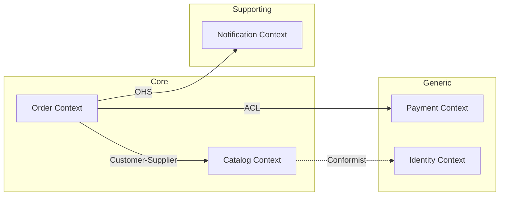

# Strategic DDD

Domain discovery and boundary definition at the organizational level. Strategic DDD answers: "Where are the boundaries?" and "How do contexts relate?"

## Subdomain Classification

Subdomains exist in the problem space. Classify before modeling.

| Type | Competitive advantage | Build or buy | DDD investment | Staffing |
|------|----------------------|--------------|----------------|----------|
| Core | Yes, unique differentiator | Build in-house | Full strategic + tactical | Senior talent |
| Supporting | No, enables core | Build (simplified) or outsource | Pragmatic tactical | Mid-level |
| Generic | No, commodity | Buy/integrate (Stripe, Auth0) | Minimal/none | Junior/integration |

**Decision heuristic**: If two competitors solve this the same way, it's Generic. If your approach gives you an edge, it's Core. Everything else is Supporting.

## Bounded Context Discovery

A bounded context is a software boundary within which a model is consistent. Different from subdomains (problem-space). They should align but are independent concepts.

### Discovery Techniques

**Language divergence** (primary signal): When the same word means different things to different groups, you've found a boundary. "Account" in billing vs. "Account" in identity. "Product" in catalog vs. "Product" in inventory.

**Organizational structure**: Teams that communicate frequently often share a context. Teams with formal handoffs often have separate contexts. Conway's Law applies.

**Consistency requirements**: Where true invariants must be maintained transactionally defines aggregate boundaries, which cluster into contexts.

**EventStorming Big Picture**: Domain events placed on timeline. When events cluster into distinct swimlanes with different actors and vocabulary, those are context candidates.

**Domain Storytelling**: Actors perform activities on work objects. When actors, activities, or work objects change meaning, you've crossed a boundary.

### Boundary Validation Checklist

- [ ] Each context has its own ubiquitous language (no term means two things)
- [ ] One team owns one context (no shared ownership)
- [ ] Context is independently deployable (no mandatory co-deployment)
- [ ] Internal model changes don't ripple to other contexts
- [ ] Data that crosses boundaries is explicitly mapped (no implicit sharing)

### Common Mistakes

1. **Context = microservice**: A context may contain multiple services; a service may handle a subdomain within a larger context
2. **Too large**: Conflicting models coexist, vocabulary is ambiguous -- split
3. **Too small**: Excessive cross-context communication, simple operations need sagas -- merge
4. **Database-first**: Sharing a database between contexts couples their models implicitly

## Context Mapping Patterns

Nine patterns describing how bounded contexts relate. Draw the context map before writing code.

### Mutually Dependent

**Partnership**: Two contexts evolve together. Both teams coordinate releases. Use when: genuinely reciprocal dependency, tight collaboration feasible. Risk: high coordination cost.

**Shared Kernel**: Small shared model subset both contexts depend on. Must be small, explicitly versioned, jointly owned. Changes require agreement from both teams.

### Upstream/Downstream

**Customer-Supplier**: Upstream serves downstream's needs. Downstream negotiates what upstream provides. Structured relationship with explicit API contracts.

**Conformist**: Downstream adopts upstream's model as-is. No negotiation. Use when: integration simplicity outweighs design freedom, or upstream won't accommodate.

**Anti-Corruption Layer (ACL)**: Downstream creates a translation layer to isolate its model from upstream's. Essential for: legacy integration, poor upstream models, protecting domain purity.

**Open Host Service (OHS)**: Upstream provides a well-defined API for multiple downstream consumers. Standardized protocol (REST, gRPC, GraphQL).

**Published Language**: Shared schema or format for inter-context communication. Examples: iCalendar, vCard, JSON Schema, Protocol Buffers.

### Independent

**Separate Ways**: No integration. Contexts have no meaningful dependency. Duplication is acceptable when coupling cost exceeds duplication cost.

**Big Ball of Mud**: Recognition pattern only. Demarcate and quarantine legacy systems. Draw a boundary around them, communicate through ACL.

### Selection Heuristic

```
Do the teams need to coordinate releases?
  YES -> Do both depend on each other equally?
    YES -> Partnership (if feasible) or Shared Kernel (if small overlap)
    NO  -> Customer-Supplier (negotiate API)
  NO  -> Is upstream model acceptable?
    YES -> Conformist (adopt as-is)
    NO  -> Anti-Corruption Layer (translate)
  Independent? -> Separate Ways
  Legacy mess? -> Big Ball of Mud + ACL
```

## Ubiquitous Language

A rigorous vocabulary shared between developers and domain experts, scoped per bounded context.

### Rules

1. Domain terms in code: class names, method names, variable names reflect domain language
2. Same term, different context: "Order" in Sales vs. "Order" in Fulfillment are different concepts -- this is expected and healthy
3. When the model is hard to express in code, the language needs refinement
4. Resolve conflicts immediately: if developers and domain experts use different words for the same concept, pick one and enforce it

### Building the Language

- Maintain a glossary per bounded context (not per system)
- Review glossary during modeling sessions
- When new terms emerge, add them; when terms change, update code
- Code review should catch language violations ("this variable should be called X, not Y")

## Context Map Visualization

Use Mermaid flowchart for context maps:



Label every arrow with the context mapping pattern. Core contexts in the center.
